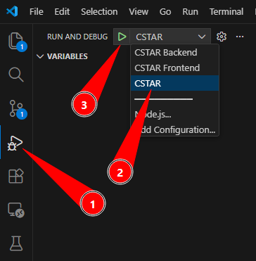
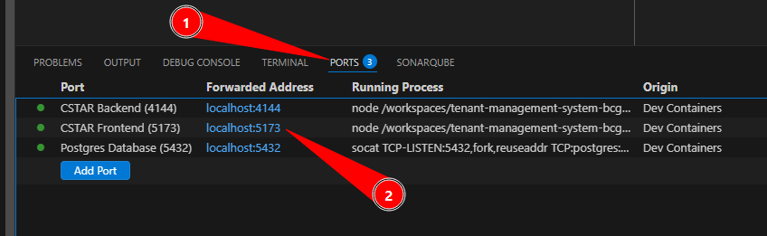
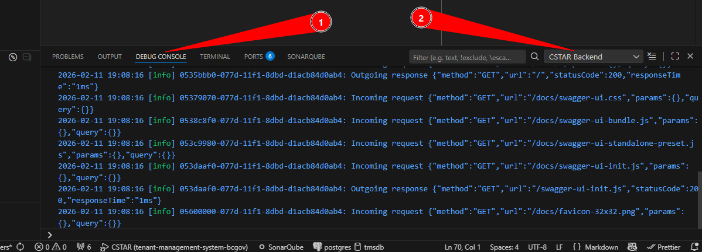

# CSTAR Dev Container

This folder contains the configuration for a Dev Container, which is a
pre-configured development environment that runs inside Docker. When the entire
team uses the Dev Container it ensures that everyone has the exact same setup.
This helps eliminate "it works on my laptop" issues.

## What is a Dev Container?

A Dev Container is a complete development workspace. When this repository is
opened in VS Code, it will:

- Build a Docker container with all needed tools
- Install VS Code extensions
- Set up the database and run the migrations
- Install frontend and backend dependencies using `npm ci`
- Configure everything so that coding can begin immediately

## Getting Started

### Prerequisites

The following need to be installed on your computer:

- Docker. If you are a government employee, you _cannot_ use Docker Desktop
  unless you have a licence for it. The recommended alternative way is to run
  Docker in WSL/Ubuntu
- Visual Studio Code

### Opening the Project

- Open the root of this repo in VS Code
- When prompted, click `Reopen in Container` (or press `F1` and select
  `Dev Containers: Reopen in Container`)
- Wait while the container builds (first time takes a few minutes)

## What's Included

### VS Code Extensions

These extensions are installed automatically:

- ESLint: Catch JavaScript errors while coding
- Prettier: Automatically format the code on save
- SonarLint: Detect code quality issues
- Vitest Explorer: Run and debug tests
- Volar: Vue.js language support

## Common Tasks

### Rebuilding the Container

The container should be rebuilt when there are changes to the backend or
frontend dependencies, or when the files in this directory change. To keep up to
date with dependency changes, it's a good idea to rebuild the container after
running `git pull` or `git rebase`.

- Press `F1`
- Select `Dev Containers: Rebuild Container`

### Starting the Application

In the left-hand "Activity Bar":

1. Select the `Run and Debug` item
2. From the drop down list select `CSTAR` to start both frontend and backend
3. Press the "play" button

### Running the Application

In the bottom-right "Panel":

1. Select the `Ports` tab
2. CTRL-click anywhere in the `CSTAR Frontend (5173)` row and the application
   will open in the browser

### Examining the Logs

In the bottom-right "Panel":

1. Select the `Debug Console` tab
2. From the drop down list select `CSTAR Backend` to view the backend logs (the
   frontend logs aren't very interesting)

### Running Builds

Sometimes it's nice to be able to test the build process before creating a pull
request. In the top menu bar select `Terminal` > `Run Task...` and then select a
task such as:

- `Backend - Build`
- `Frontend - Build`

### Running Tests

In the top menu bar select `Terminal` > `Run Task...` and then select a task
such as:

- `Backend - Lint`
- `Backend - Unit Tests`
- `Backend - Unit Tests (Coverage)`
- `Frontend - Lint`
- `Frontend - Unit Tests`
- `Frontend - Unit Tests (Coverage)`
