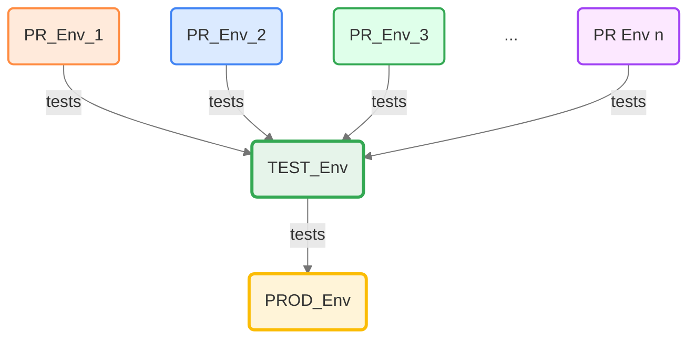
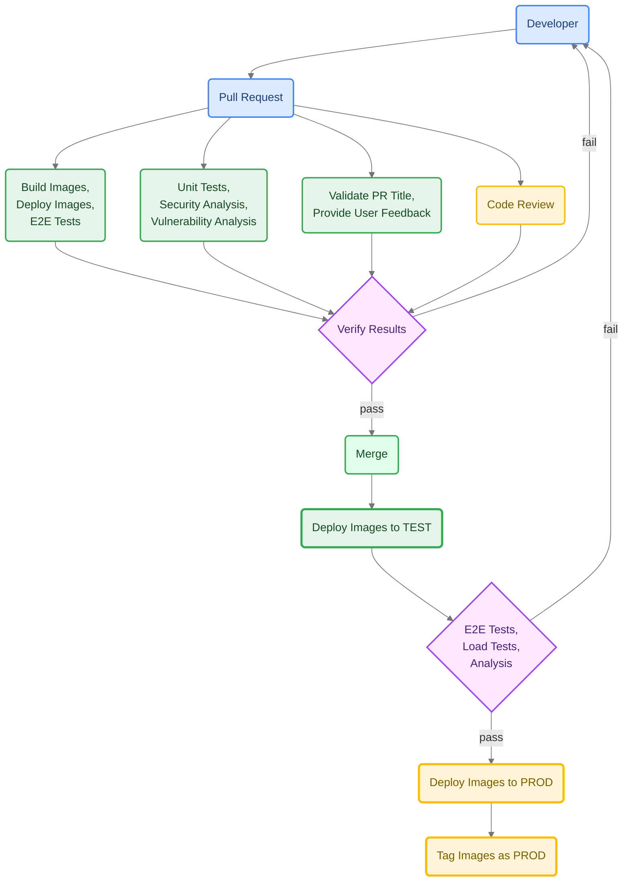

# Pull Request-Based Workflows

This repository is based on the [quickstart-openshift](https://github.com/bcgov/quickstart-openshift) repository that provides a template to rapidly deploy a modern web application stack to the BC Government's OpenShift platform. It uses [GitHub Actions](https://github.com/bcgov/tenant-management-system/actions) and incorporates best practices for CI/CD, security, and observability.

Includes:

- Pull Request-based pipeline
- Sandboxed Pull Request deployments
- Gated test and production deployments
- Container publishing (ghcr.io) and importing (OpenShift)
- Security, vulnerability, infrastructure, and container scan tools
<!-- TODO
- Automatic dependency patching available from [bcgov/renovate-config](https://github.com/bcgov/renovate-config)
  -->
- Enforced code reviews and workflow jobs (pass|fail)
- Helm Package Manager
<!--TODO
- Prometheus Metrics export from Backend/Frontend
- Resource Tuning with Horizontal Pod Autoscaler
  -->
- Affinity and anti-affinity for Scheduling on different worker nodes
- Rolling updates with zero downtime
- Pod disruption budgets for high availability
- Self-healing through probes/checks (startup, readiness, liveness)
- Point the long-lived DEMO route to PRs by using the `demo` label
- Sample application stack:
  - Database: Crunchy (Postgres), backups
  - Frontend: TypeScript, Vue.js, Caddy Server
  - Backend: TypeScript, Express, Node

## Workflows

These workflows and actions enforce a pull request based flow.

Here's a more detailed view showing a single pull request.

### Pull Request

Runs on pull request submission.

- Provides safe, sandboxed deployment environments
- Build action pushes to GitHub Container Registry (ghcr.io)
- Build triggers select new builds vs reusing builds
- Deploy only when changes are made
- Deployment includes curl checks and optional penetration tests
- Run tests (e2e, load, integration) when changes are made
- Other checks and updates as required

### Validation

Runs on pull request submission.

- Enforces conventional commits in PR title
- Adds greetings/directions to PR descriptions

### Analysis

Runs on pull request submission or merge to the default branch.

- Unit tests (should include coverage)
- CodeQL/GitHub security reporting (now handled as GitHub default!)
- Trivy password, vulnerability and security scanning

### Pull Request Closed

Runs on pull request close or merge.

- Cleans up OpenShift objects/artifacts
- Merge retags successful build images as `latest`

### Merge

Runs on merge to main branch.

- Code scanning and reporting to GitHub Security overview
- Zero-downtime DEV deployment
<!-- TODO
- Penetration tests on TEST deployment (optional)
  -->
- Zero-downtime TEST deployment
- Zero-downtime PROD deployment
- Labels successful deployment images as PROD

### Scheduled

Runs on scheduled job (cronjob) or workflow dispatch.

- PR environment purge
- Generate SchemaSpy documentation
- Tests (e2e, load, integration) on TEST deployment

### DEMO Routing

There is a long-lived custom route available to be assigned to specific Pull Request deployments. Add the label `demo` to that pull request or run the `DEMO Route` workflow.

Typical route: `https://<REPO_NAME>-demo.apps.silver.devops.gov.bc.ca`

#### PR Label

Please note that the label must be manually created using GitHub's web interface.

## Setup: GitHub Environments, Variables, and Secrets

### Environments

The repository is set up with environments for `DEV`, `TEST`, and `PROD`. These environments are for variables and secrets that have different values depending on their environment.

### Environment-specific Variables

If a value is different in all environments and is not a secret, it it stored in a GitHub Environment Variable.

- `Settings` > `Environments` > `DEV` (for example), then scroll down to `Environment variables`

There is an `Add environment variable` button for creating new variables. Each variable has an edit icon for changing the value.

**`BCGOV_SSO_API_URL`**

The URL for the SSO API to look up IDIR users.

- Consume: `${{ vars.BCGOV_SSO_API_URL }}`
- DEV Value: `https://api.loginproxy.gov.bc.ca/api/v1/dev/idir/users`
- TEST Value: `https://api.loginproxy.gov.bc.ca/api/v1/test/idir/users`
- PROD Value: `https://api.loginproxy.gov.bc.ca/api/v1/idir/users`

**`BCGOV_SSO_API_URL_BCEID`**

The URL for the SSO API to look up BCeID users.

- Consume: `${{ vars.BCGOV_SSO_API_URL_BCeID }}`
- DEV Value: `https://api.loginproxy.gov.bc.ca/api/v1/dev/bceid/users`
- TEST Value: `https://api.loginproxy.gov.bc.ca/api/v1/test/bceid/users`
- PROD Value: `https://api.loginproxy.gov.bc.ca/api/v1/bceid/users`

**`LOGIN_PROXY_HOST_NAME`**

The environment-specific host name of the login proxy server.

- Consume: `${{ vars.LOGIN_PROXY_HOST_NAME }}`
- DEV Value: `dev.loginproxy.gov.bc.ca`
- TEST Value: `test.loginproxy.gov.bc.ca`
- PROD Value: `loginproxy.gov.bc.ca`

### Environment-specific Secrets

If a value is different in all environments and is a secret, it it stored in a GitHub Environment Secret.

- `Settings` > `Environments` > `DEV` (for example), then scroll down to `Environment secrets`

There is an `Add environment secret` button for creating new secrets. Each secret has an edit button for replacing the value. Secrets, once set, are not visible and cannot be edited.

**`OC_NAMESPACE`**

Teams will receive a set of project namespaces, usually DEV (for PRs), TEST and PROD. TOOLS namespaces are not used here. Provided by your OpenShift platform team.

- Consume: `${{ secrets.OC_NAMESPACE }}`
- E.g.: `abc123-dev`

**`OC_TOKEN`**

OpenShift's service account token, different for every namespace. The OpenShift platform team has provisioned a pipeline account.

- Consume: `${{ secrets.OC_TOKEN }}`

Locate an OpenShift pipeline token:

1. Login to the OpenShift cluster [Silver](https://console.apps.silver.devops.gov.bc.ca/)
2. Select a namespace, such as DEV
3. Click `Workloads` > `Secrets` (for Administrator view)
4. Select `pipeline-token-...` or a similarly privileged token
5. Under Data, copy `token`
6. Paste into the GitHub Secret `OC_TOKEN`

### Repository Variables

If a value is the same in all environments and is not a secret, it it stored in a GitHub Repository Variable.

- `Settings` > `Secrets and Variables` > `Actions` then in the `Variables` tab scroll down to `Repository variables`

There is a `New repository variable` button for creating new variables. Each variable has an edit icon for changing the value.

**`BCGOV_TOKEN_URL`**

The token URL used when calling the SSO API. This needs to be set up in the SSO CSS application.

- Consume: `${{ vars.BCGOV_TOKEN_URL }}`

Locate the SSO API token URL:

1. Log into the [SSO CSS Application](https://sso-requests.apps.gold.devops.gov.bc.ca)
1. Select `My Dashboard` in the top navigation bar
1. Select `My Teams` in the second navigation bar
1. Select the team for this application
1. In the `Team Detail` switch to the `CSS API Account`
1. Download or copy the API Account information
1. Use the `tokenUrl` value

**`LOGIN_PROXY_CLIENT_ID`**

The client ID for the login proxy server.

- Consume: `${{ vars.LOGIN_PROXY_CLIENT_ID }}`
- Value: client identifier from the SSO CSS application

**`MSTEAMS_WEBHOOK`**

> _currently unused_

- Consume: `${{ vars.MSTEAMS_WEBHOOK }}`
- Value: See MS Teams documentation for [webhooks](https://learn.microsoft.com/en-us/microsoftteams/platform/webhooks-and-connectors/how-to/add-incoming-webhook?tabs=newteams%2Cdotnet) and [message cards](https://learn.microsoft.com/en-us/outlook/actionable-messages/message-card-reference)

**`OC_SERVER`**

OpenShift server address.

- Consume: `${{ vars.OC_SERVER }}`
- Value: `https://api.silver.devops.gov.bc.ca:6443`

### Repository Secrets

If a value is the same in all environments and is a secret, it it stored in a GitHub Repository Secret.

- `Settings` > `Secrets and Variables` > `Actions` then in the `Secrets` tab scroll down to `Repository secrets`

There is a `New repository secret` button for creating new secrets. Each secret has an edit button for replacing the valu. Secrets, once set, are not visible and cannot be edited.

**`BCGOV_SSO_API_CLIENT_ID`**

The client ID used to call the SSO API. This needs to be set up in the SSO CSS application.

- Consume: `${{ secrets.BCGOV_SSO_API_CLIENT_ID }}`

Locate the SSO API client ID:

1. Log into the [SSO CSS Application](https://sso-requests.apps.gold.devops.gov.bc.ca)
1. Select `My Dashboard` in the top navigation bar
1. Select `My Teams` in the second navigation bar
1. Select the team for this application
1. In the `Team Detail` switch to the `CSS API Account`
1. Download or copy the API Account information
1. Use the `clientId` value

**`BCGOV_SSO_API_CLIENT_SECRET`**

The client secret used to call the SSO API. This needs to be set up in the SSO CSS application.

- Consume: `${{ secrets.BCGOV_SSO_API_CLIENT_SECRET }}`

Locate the SSO API client secret:

1. Log into the [SSO CSS Application](https://sso-requests.apps.gold.devops.gov.bc.ca)
1. Select `My Dashboard` in the top navigation bar
1. Select `My Teams` in the second navigation bar
1. Select the team for this application
1. In the `Team Detail` switch to the `CSS API Account`
1. Download or copy the API Account information
1. Use the `clientSecret` value

**`SONAR_TOKEN_BACKEND`**

SonarCloud is being used for code quality, and the backend code has its own token.

- Consume: `${{ secrets.SONAR_TOKEN_BACKEND }}`

Unfortunately this token is tied to a user and not the project in SonarCloud.

**`SONAR_TOKEN_FRONTEND`**

SonarCloud is being used for code quality, and the frontend code has its own token.

- Consume: `${{ secrets.SONAR_TOKEN_FRONTEND }}`

Unfortunately this token is tied to a user and not the project in SonarCloud.
