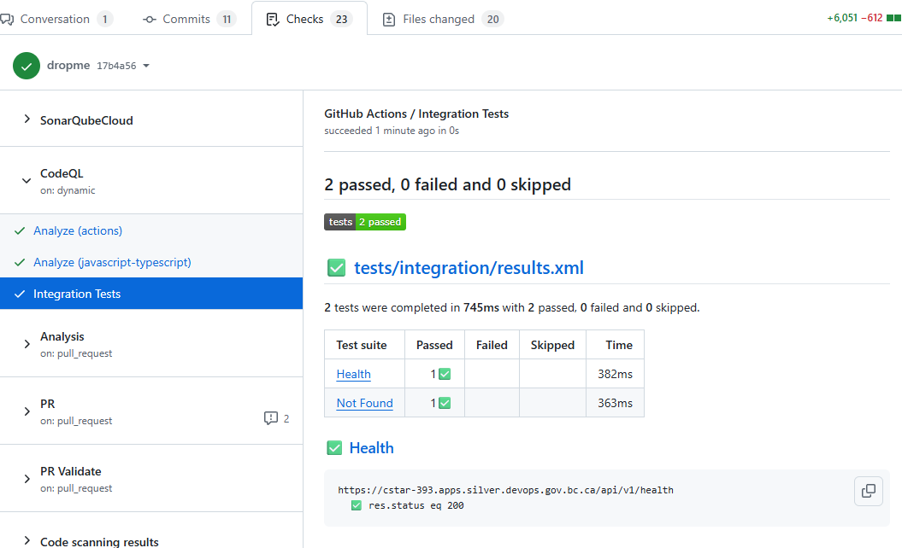

# Integration Tests

Bruno-based API integration tests. The intention of these is to test the
integration of:

- The API middleware
- The API route layer
- The API controller layer
- The API service layer
- The API ORM layer
- The database

What is important is the ommission of Keycloak/SSO, which is explicitly out of
scope for these tests.

> Note: These tests are _currently_ a proof of concept. They do not create,
> modify, or delete data, but may do so now that they run against an ephemeral
> database.

## Running Locally

These tests can be run locally:

- run `npm ci`
- start the backend (`Run and Debug` in Activity Bar > `CSTAR` or
  `CSTAR Backend`)
- run `npm test`

## Running in GitHub Actions

When these tests run for a pull request, they run against a containerized API
and a new empty database. The best way to view the results is in the CodeQL
section of the checks:

These tests also always run after merge, again against the containerize API
image and an empty database. If they fail they will block deployment to `test`.
